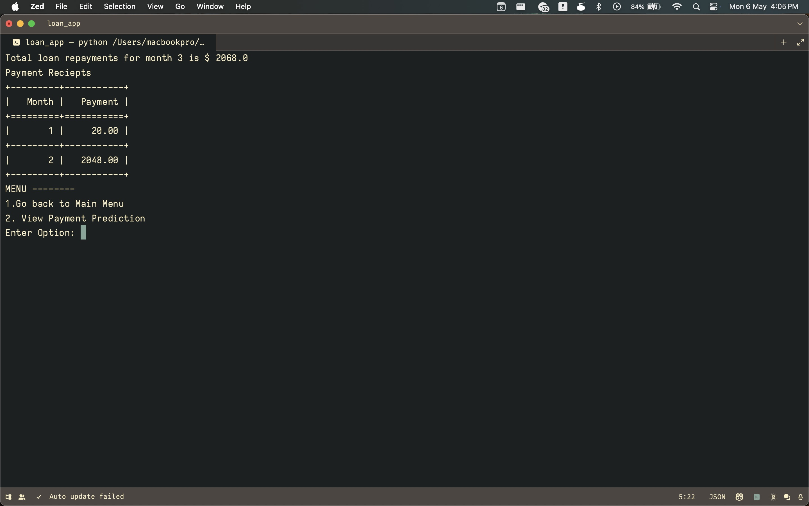
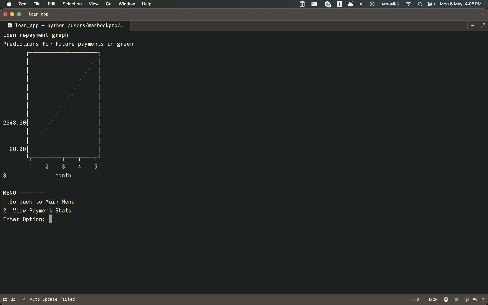
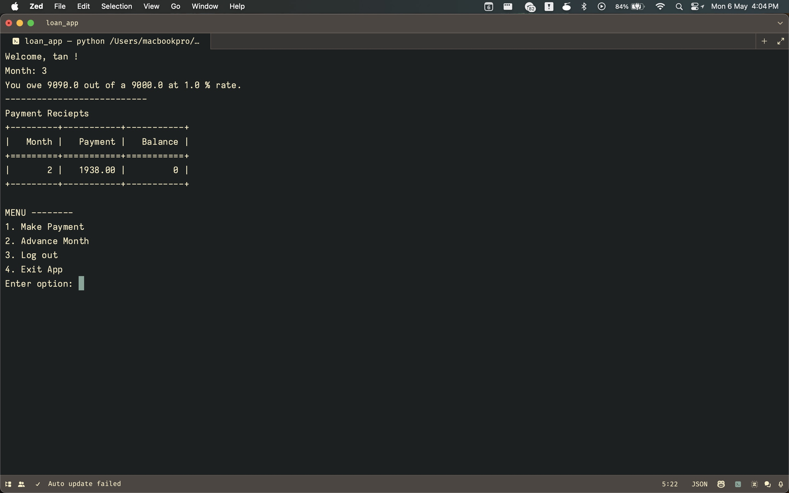

# Loan Repayment Model

### to run:

1. install [`rye`](https://rye-up.com/guide/installation/).
2. clone the project: `git clone https://github.com/tanthehack/arrakis`.
3. change into this directory: `cd loan`
4. install the dependencies: `rye sync`.
5. run the app: `rye run loan`.

### images:
||
|:------:|
|   |
|    _the admin dashboard - Payment Stats_       |
|   |
|     _the user dashboard - Payment Predictions_ |
|     |
| _the user dashboard page_ |
