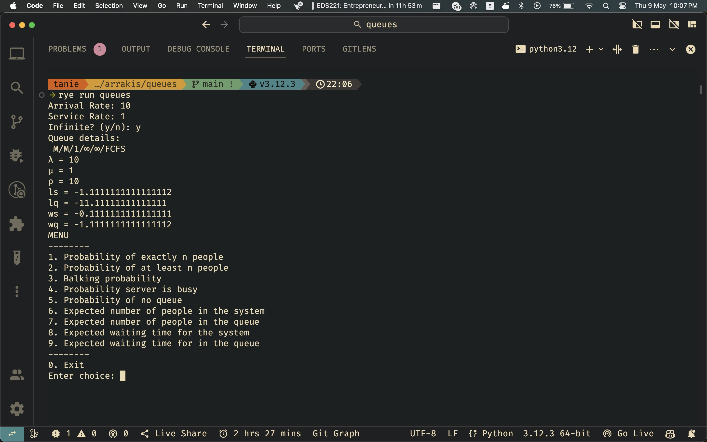

# queues

modelling assignment to simulate queues.

### to run:

1. install [`rye`](https://rye-up.com/guide/installation/).
2. clone the project folder: `git clone https://github.com/tanthehack/arrakis`.
3. change into this directory: `cd queues`
4. install the dependencies: `rye sync`.
5. run the app: `rye run queues`.

### images:

The model implementation:

